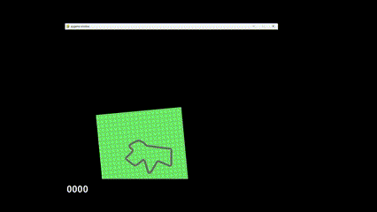

# Car_racing_PPO_DDPG

### Short project description
This project was done in the Tools of Artificial Intelligence course of the Master's programme "Robot Systems - Advanced Robotics Technology" at the University of Southern Denmark (SDU). The task was to implement and use at least two algorithms related to neural networks, reinforcement learning or other algorithms related to the lecture.

It includes a PPO algorithm optimized for training an reinforcement learning agent to navigate through the Gymnasium Car-Racing environment. Additionally, it uses DDPG from the Stable-Baselines3 library to train an agent for comparison.

The documentation of this project was submitted to the university on 01/06/2024 in form of a report.

### Trained models
This GitHub includes 4 trained models. Each was trained approx. 2000 episodes with each 1000 timesteps. The parameters are the same except the reward structure:
- v4 - use Gymnasium's intrinsic reward structure (penalize die and don't penalize green)
- v3 - don't penalize die
- v2 - penalize green with additional -0.1 reward
- v1 - use optimized reward structure

Link to video of test run for -v4: https://youtu.be/o1dTX2vz5TY

Link to video of test run for -v1: [https://youtu.be/\_GDW0iDM\_r8](https://youtu.be/_GDW0iDM_r8)

### Description of the folders and files:
- DDPG: Contains all files used for training the agent with DDPG and visualizing the results
  - main.ipynb
    - Run this for training the agent with DDPG from the Stable-Baselines3 library
  - data.txt
    - Contains the result data obtained during training
  - visu.py
    - Run this for visualizing the results in the data.txt file 
- PPO: Contains the used PPO algorithm and files for visualizing results
  - models
    - Contains the above described trained models
  - results
    - Contains the result diagrams
  - Training/Logs
    - Contains the training log data of the above described trained models
  - agent.py
    - Contains the Agent class
  - config.py
    - Defines most hyperparameters in the Config class. Allows for easy parameter changes
  - env.py
    - Contains the Env class for loading the Gynmasium Car-Racing environment
  - model.py
    - Contains the Net class which defines the Actor-Critic Network for the PPO algorithm
  - results_optimized_reward.txt
    - Containts the data of 50 test runs with the model -v1
  - results_original_reward.txt
    - Containts the data of 50 test runs with the model -v4
  - statistical_test.m
    - For performing the Mann Whitney-U test to compare the test run results
  - test.py
    - Run this for testing a model (remember to change the model_name and render_mode in config.py)
  - train.py
    - Run this for training a model (remember to change the model_name, render_mode and csv_log_file in config.py)
  - visu.py
    - Run this for visualizing the training results saved in Training/Logs
- requirements.txt: Contains all required libraries for running the code
